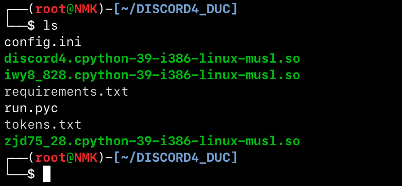
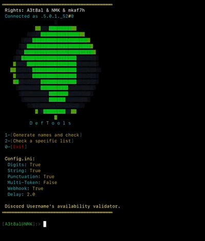

# Discord4


**Discord4** is a ready-to-run Discord username availability tool developed by **A3t8al**. It is distributed as a packaged release, not as Python source code, and is designed to run on **iOS**, **Android**, and **Linux**.


The package includes a compiled Python launcher and protected `.so` files. Run the files as provided; do not edit, rename, or remove them.


> Use this tool only with Discord accounts and systems that you own or are explicitly authorized to use. Follow Discord's Terms of Service, API rules, rate limits, and applicable laws. Do not use automation to bypass platform protections or access accounts without permission.
> 


## Preview


### Tool Files





### Tool Preview





## Package Contents


```text

Discord4/

├── config.ini

├── discord4.cpython-39-i386-linux-musl.so

├── iwy8_828.cpython-39-i386-linux-musl.so

├── requirements.txt

├── run.pyc

├── tokens.txt

└── zjd75_28.cpython-39-i386-linux-musl.so

```


- `run.pyc`: Compiled Python launcher.
- 
- `*.so`: Protected/compiled native files required by the package.
- 
- `config.ini`: Configuration file.
- 
- `requirements.txt`: Required Python packages.
- 
- `tokens.txt`: Sensitive account data; keep it private.
- 


This repository contains packaged release files, not the original Python source code.


## Requirements


- Python 3
- 
- pip
- 
- Git, if you want to clone the repository
- 
- An authorized Discord account
- 


## Download from GitHub


```bash

git clone https://github.com/A3t8al/discord4.git

cd discord4

```


Alternatively, open the [Discord4 repository](https://github.com/A3t8al/discord4), select **Code**, choose **Download ZIP**, extract it, and open the project folder.


## Installation and Usage


Install the dependencies:


```bash

python3 -m pip install -r requirements.txt

```


Then run the packaged tool:


```bash

python run.pyc

```


If your system uses `python3` as the Python command, use:


```bash

python3 run.pyc

```


No source-code editing is required. The launcher loads the protected files automatically.


## iOS: iSH


1. Install [iSH Shell](https://apps.apple.com/sa/app/ish-shell/id1436902243).
2. 
2. Open iSH and run:
3. 


```bash

apk update

apk add python3 py3-pip git unzip

git clone https://github.com/A3t8al/discord4.git

cd discord4

python3 -m pip install -r requirements.txt

python3 run.pyc

```


If iSH reports an architecture or `.so` compatibility error, use a compatible release from the tool author. Do not modify the protected files.


## Android: Termux


1. Install Termux from [F-Droid](https://f-droid.org/packages/com.termux/) or the [official Termux GitHub repository](https://github.com/termux/termux-app/).
2. 
2. Open Termux and run:
3. 


```bash

pkg update && pkg upgrade

pkg install python git unzip

git clone https://github.com/A3t8al/discord4.git

cd discord4

python -m pip install -r requirements.txt

python run.pyc

```


If Termux reports a native-library or architecture error, use the correct release for your device and do not alter the `.so` files.


## Linux


For Debian or Ubuntu:


```bash

sudo apt update

sudo apt install python3 python3-pip git

git clone https://github.com/A3t8al/discord4.git

cd discord4

python3 -m pip install -r requirements.txt

python3 run.pyc

```


## Security Notice


Keep `tokens.txt` private. Do not publish tokens, passwords, or other credentials in a public repos


